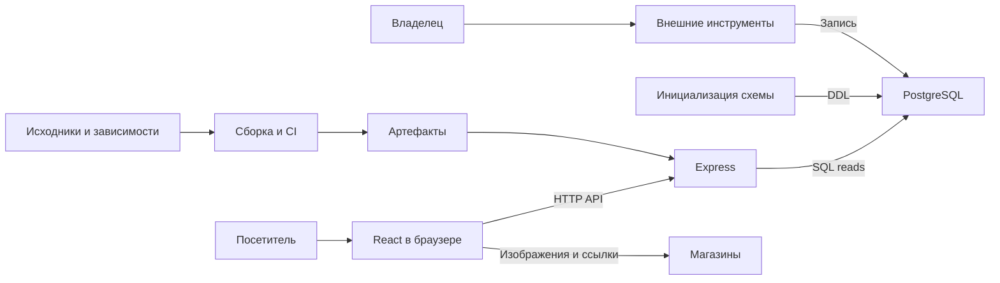

# Coffee DB: аудит безопасности и модель угроз

Дата: 2026-09-08. Проверенная ревизия: `3cf3f202d29f66ac352d0038fc88ef9217f47a34`.

## Executive summary

В статически проверенном коде не подтверждены эксплуатируемые уязвимости. Публичные параметры проходят валидацию и параметризацию SQL; внешние URL ограничены HTTP(S), текст выводится через React без вставки HTML. Перед публикацией приоритетны проверка устойчивости к нагрузке, минимизация прав подключения к БД и защитные заголовки. Это рекомендации по усилению защиты, а не доказанные SQL injection, XSS или DoS. Отсутствие находок не подтверждает безопасность зависимостей и реального развёртывания.

## Scope and assumptions

- Проверены исходники `server/src`, `client/src`, тесты, конфигурация сборки, npm-манифесты, CI, документация и структура lockfile. Выполнены независимый статический аудит и отдельная проверка архитектуры.
- Пользователь подтвердил: **данные каталога сейчас меняет только он через внешние ресурсы, не через это приложение**. Следовательно, обычный посетитель не считается автором записей БД.
- Публичный read-only каталог, отсутствие аккаунтов, покупок и импорта в приложении следуют из `PRODUCT.md:3`, `PRODUCT.md:16` и `server/src/catalog/routes.ts:20`. Доступ из интернета рассматривается как сценарий будущего развёртывания, а не подтверждённое состояние.
- Не проверялись `.env` и `.env*` — по ограничению пользователя. Не проверялись реальные секреты, записи БД, инфраструктура, внешние инструменты импорта, Git history, скомпилированные артефакты и исходники сторонних пакетов.
- Аудит исходников проведён офлайн. Приложение, интеграционные тесты, нагрузочные сценарии и `npm audit` не запускались. Статическая проверка существующих тестов не равна их успешному выполнению.
- Упомянутый в README/PRODUCT файл `docs/handoff.md` отсутствует. Схема и контракт восстановлены из реализации и `docs/catalog-api.md`; устаревшие утверждения руководств об отсутствии БД не приняты за фактическую архитектуру.

Открытые вопросы: место запуска и доступность origin-сервера; TLS на входе и к PostgreSQL; rate limiting/CDN; реальные GRANT и резервные копии; размер БД и допустимая нагрузка. Они влияют на приоритет рекомендаций ниже. Уточнение владельца данных получено до финализации отчёта.

## System model

### Primary components

| Компонент                        | Назначение и свидетельство                                                                                                            |
| -------------------------------- | ------------------------------------------------------------------------------------------------------------------------------------- |
| React SPA, Vite, MUI, TypeScript | Два каталога, фильтры и URL-state; `client/src/catalog/Catalog.tsx:1`, `client/vite.config.ts:1`                                      |
| Node.js / Express API            | Health, списки, facets, stats, production SPA; `server/src/appFactory.ts:27`                                                          |
| PostgreSQL / pg                  | Запросы каталога и пул соединений; `server/src/catalog/repository.ts:25`, `server/src/database.ts:20`                                 |
| Инициализация схемы              | DDL до запуска listener, advisory lock, постоянные определения индексов; `server/src/index.ts:16`, `server/src/database.ts:49`        |
| Внешние магазины                 | Изображения загружает браузер, ссылки открывает посетитель; `client/src/catalog/Cards.tsx:6`                                          |
| CI и инструменты разработчика    | npm ci, тесты, dependency review и npm audit; `.github/workflows/security-audit.yml:14`, `.github/workflows/dependency-review.yml:10` |

### Data flows and trust boundaries

- Посетитель → API: URL/query по HTTP; параметры повторений, длины, чисел, enum и составного города проверяются в `server/src/catalog/validation.ts:17`. Аутентификация не требуется для публичных чтений. Ограничитель частоты в приложении отсутствует; инфраструктурный неизвестен.
- API → PostgreSQL: SQL и значения через `pg`, учётные данные из process configuration; `server/src/index.ts:7`. Значения передаются отдельно от SQL (`server/src/catalog/sql.ts:18`); TLS и полномочия фактической роли не установлены. Пул: 8 соединений, ожидание соединения 10 секунд, statement timeout 15 секунд (`server/src/database.ts:20`).
- Владелец → внешние инструменты → БД: операции изменения по подтверждению пользователя; их протоколы, права и валидация находятся вне репозитория. Приложение не предоставляет посетителю этот путь.
- БД → API → браузер: выбранные публичные поля, JSON и JSX. URL проверяются на сервере и клиенте (`server/src/catalog/mapping.ts:3`, `client/src/catalog/format.ts:82`); нет динамического HTML-шаблона.
- Браузер → магазин: HTTP(S) для изображения либо перехода. `noopener noreferrer` защищает opener, `no-referrer` ограничивает передачу referrer (`client/src/catalog/Cards.tsx:16`, `client/src/catalog/Cards.tsx:36`). Магазин всё равно видит сетевой адрес посетителя; серверный SSRF из этого потока не следует.
- Исходники/пакеты → CI → артефакт SPA/API: доверие к принятым изменениям и цепочке зависимостей. CI использует `pull_request` и read permissions (`.github/workflows/security-audit.yml:3`); механизм production deployment не представлен.

| Режим / потребитель | Конфигурация и фактический ресурс                                                 | Контроль / неизвестное                                                                                                                                |
| ------------------- | --------------------------------------------------------------------------------- | ----------------------------------------------------------------------------------------------------------------------------------------------------- |
| Runtime SQL         | `DATABASE_URL` → `createDatabase` → repository                                    | SQL параметризован; секрет не читался, TLS/GRANT неизвестны; `server/src/index.ts:7`                                                                  |
| Startup SQL         | `DATABASE_SCHEMA_URL`, иначе тот же runtime pool                                  | Отдельный pool закрывается после DDL; README требует те же БД/схему/роль, но код не сверяет их соответствие; `server/src/index.ts:10`, `README.md:39` |
| HTTP listener       | `PORT`, иначе 3000; `app.listen(port)` без явного loopback                        | Текст лога «localhost» не устанавливает ограничение сетевой доступности; нужен firewall/proxy deployment contract; `server/src/index.ts:20`           |
| Production static   | Фиксированный `client/dist` и `index.html`, опции factory задаёт доверенный код   | Пользовательский query не задаёт путь; `server/src/appFactory.ts:23`, `server/src/appFactory.ts:52`                                                   |
| Dev proxy           | `/api` → фиксированный `http://localhost:3000`                                    | Dev-инструмент; не production SSRF proxy; `client/vite.config.ts:8`                                                                                   |
| E2E / integration   | Fixtures на 127.0.0.1; integration создаёт временную схему в операторской test DB | Отдельный entrypoint, адрес test DB выбирает оператор; эти тесты не запускались; `tests/e2e/server.ts:4`, `tests/integration/catalog.test.ts:9`       |

#### Diagram

## Assets and security objectives

| Asset                        | Why it matters                                                            | Security objective (C/I/A)                            |
| ---------------------------- | ------------------------------------------------------------------------- | ----------------------------------------------------- |
| Данные и схема каталога      | Изменение или удаление нарушает доверие и работу сервиса                  | I/A: запись только владельцем и доверенным startup    |
| Учётные данные БД            | Позволяют обращаться к БД с правами роли                                  | C: не попадать в API, bundle и логи; I: минимум прав  |
| CPU, память, пул и бюджет БД | Публичный поиск использует общие ресурсы                                  | A: ограниченная нагрузка и восстановление             |
| SPA и зависимости            | Определяют код, выполняемый у посетителей                                 | I: проверяемые изменения и сборки                     |
| Посетитель и его браузер     | Не должен выполнять код из данных или терять приватность сверх ожидаемого | C/I: безопасный вывод, контролируемые внешние ресурсы |

## Attacker model

### Capabilities

Посетитель может отправлять HTTP-запросы с произвольными query/body/headers, повторять валидные запросы и распространять ссылки на каталог. Оператор внешнего магазина контролирует ответы своего image host и страницы перехода. Компрометация зависимости или источника внешнего импорта рассматривается как отдельное условие, а не исходная возможность каждого посетителя.

### Non-capabilities

Не предполагаются доступ к БД, секретам, файловой системе, запуску сервера, CI credentials и право менять каталог. По ответу пользователя запись принадлежит только ему. Нет оснований приписывать сервису tenants, приватные аккаунты или финансовые операции. Чтение публичных данных и последовательных ID не является IDOR; сам по себе UUID здесь не создаёт нужной защиты.

## Entry points and attack surfaces

| Surface                                       | How reached                     | Trust boundary                | Notes                                                  | Evidence                                                             |
| --------------------------------------------- | ------------------------------- | ----------------------------- | ------------------------------------------------------ | -------------------------------------------------------------------- |
| Списки `/api/coffees`, `/api/roasters`        | GET и query                     | Internet → API → DB           | Search/sort/filter/page, фиксированная проекция        | `server/src/catalog/routes.ts:23`                                    |
| `/api/coffees/facets`, `/api/roasters/facets` | GET и query                     | Internet → API → DB           | GROUP BY, поиск опций, offset                          | `server/src/catalog/routes.ts:28`                                    |
| `/api/catalog/stats`                          | GET                             | Internet → DB compute         | Глобальные counts                                      | `server/src/catalog/repository.ts:110`                               |
| `/health`, `/api/health`                      | GET                             | Internet → процесс            | Фиксированный ответ, не readiness БД                   | `server/src/appFactory.ts:19`                                        |
| JSON parser и неизвестные routes              | HTTP, в том числе body          | Internet → parser             | Parser глобальный, тела каталог не использует          | `server/src/appFactory.ts:34`                                        |
| SPA и статические файлы                       | GET                             | Internet → build output       | Фиксированная директория, без uploads                  | `server/src/appFactory.ts:52`                                        |
| Внешние URL                                   | DB → cards                      | DB → browser → shop           | Scheme validation не является проверкой репутации host | `server/src/catalog/mapping.ts:3`, `client/src/catalog/Cards.tsx:30` |
| DDL, CI, integration                          | Действия владельца/разработчика | Privileged tooling → DB/build | Не удалённые API, отдельно от runtime                  | `server/src/database.ts:49`, `tests/integration/catalog.test.ts:9`   |

## Top abuse paths

Это сценарии модели угроз; подтверждённых эксплуатируемых цепочек в данном аудите нет.

1. **TM-001, перегрузка:** публичный клиент повторяет валидные count/facet/search запросы → растёт нагрузка и ожидание пула → деградируют ответы. Есть ограничения параметров, пул, timeout и индексы; достижимый порог отказа без нагрузочного теста неизвестен.
2. **TM-002, увеличение ущерба после компрометации:** отдельная утечка runtime credential → использование роли, владеющей таблицами → изменение/удаление каталога. Первая утечка не обнаружена; рекомендации касаются минимизации последствий.
3. **TM-003, подмена данных внешнего источника:** компрометация источника, который затем импортирует владелец → подставленная ссылка/image host → внешний переход или отслеживание посетителя. Посетитель сам записать URL не может; опасные схемы блокируются, XSS и server SSRF не подтверждены.
4. **TM-004, обход безопасного вывода в будущем:** будущий raw HTML sink или скомпрометированный JS → исполнение кода у посетителя при отсутствии дополнительной CSP. Сейчас такой sink не найден; отсутствие CSP само по себе XSS не доказывает.
5. **TM-005, supply chain:** вредоносное обновление пакета/action → принятие и выполнение в сборке → изменённый артефакт. Lockfile, review и read-only CI снижают риск; признаков компрометации нет.
6. **TM-006, ошибки на внешнем HTTP boundary:** некорректное JSON body → ошибка до catalogue error handler → отличающийся от API контракт ответа/недостаточная диагностика. Production script устанавливает production mode; утечка секретов не доказана.

## Threat model table

Вероятность отражает всю цепочку с предпосылками. Priority — условный риск сценария, не severity подтверждённой находки.

| Threat ID | Threat source                             | Prerequisites                                                   | Threat action                            | Impact                    | Impacted assets | Existing controls (evidence)                                                                            | Gaps                                                            | Recommended mitigations                                               | Detection ideas                                | Likelihood                                       | Impact severity                  | Priority |
| --------- | ----------------------------------------- | --------------------------------------------------------------- | ---------------------------------------- | ------------------------- | --------------- | ------------------------------------------------------------------------------------------------------- | --------------------------------------------------------------- | --------------------------------------------------------------------- | ---------------------------------------------- | ------------------------------------------------ | -------------------------------- | -------- |
| TM-001    | Публичный клиент                          | Доступный API, достаточная нагрузка без эффективной edge-защиты | Повторяет дорогие чтения                 | Временная деградация      | DB/compute      | Pool/timeouts `server/src/database.ts:20`, bounds `server/src/catalog/validation.ts:66`                 | Admission control в коде отсутствует; инфраструктура неизвестна | Лимит запросов и одновременной работы; cache stats; измерить нагрузку | Latency, waiting count, 503, DB CPU            | medium: вход открыт по проекту, порог не измерен | medium: временная доступность    | low      |
| TM-002    | Получивший credential атакующий           | Отдельная компрометация, роль владеет таблицами                 | Записывает/удаляет данные                | Потеря целостности        | Каталог/схема   | Параметризованный SQL; `server/src/catalog/sql.ts:18`                                                   | Startup/runtime права по README совмещены                       | Runtime SELECT, отдельная migration роль                              | DDL/DML от runtime role, backup restore checks | low: начальной утечки нет                        | high: возможна потеря каталога   | low      |
| TM-003    | Оператор/захватчик внешнего источника     | Владелец импортировал URL атакующего либо магазин захвачен      | Получает запрос изображения/переход      | Tracking/phishing         | Посетитель      | HTTP(S), no-referrer/noopener; `client/src/catalog/Cards.tsx:16`                                        | Не проверяются host reputation/credentials в URL                | Проверять источники при импорте; HTTPS там, где поддерживается        | Изменение доменов источников                   | low: owner-only запись                           | low: без доказанной кражи данных | low      |
| TM-004    | Атакующий с дополнительным JS/HTML входом | Новый sink или отдельная supply-chain компрометация             | Выполняет код в origin                   | Подмена страницы          | SPA/посетитель  | Безопасный JSX, `client/src/catalog/Cards.tsx:54`                                                       | CSP/frame policy в приложении не заданы                         | CSP и frame-ancestors на app/edge                                     | CSP reports                                    | low: sink отсутствует                            | high: условный контроль origin   | low      |
| TM-005    | Компрометированный поставщик              | Вредоносное обновление принято/скачано                          | Меняет build/runtime                     | Подмена артефактов        | Код и БД        | npm ci/audit, read permissions; `.github/workflows/security-audit.yml:11`                               | Actions указаны тегами; свежий advisory audit не выполнен       | Pin actions SHA; продолжать dependency review                         | Alerts, review lockfile changes                | low: компрометация не установлена                | high: код в доверенном процессе  | low      |
| TM-006    | Публичный клиент                          | Запрос проходит edge к JSON parser                              | Вызывает parser error вне router handler | Непоследовательные ошибки | Диагностика/API | Generic catalogue errors `server/src/catalog/routes.ts:41`, production startup `server/package.json:11` | Нет общего app error handler                                    | Удалить ненужный parser; общий безопасный handler                     | Счётчики 400/413/503, request ID               | high: некорректный body доступен                 | low: секреты не доказаны         | low      |

## Criticality calibration

- **Critical:** доказанный pre-auth RCE с широким контролем сервера/БД; публичная выдача действующего привилегированного секрета, допускающая немедленный разрушительный доступ. Ни то ни другое не найдено.
- **High:** достижимое неавторизованное изменение каталога; подтверждённый XSS с реалистичным контролем входа и существенным ущербом. Отсутствие авторизации на намеренно публичных чтениях сюда не относится.
- **Medium:** надёжно воспроизводимая дешёвая атака на доступность общего сервиса; частичная выдача действительно закрытых данных. Массовое чтение публичных counts не является такой утечкой.
- **Low:** условная нагрузочная деградация с существующими лимитами; небольшой информационный эффект ошибок; цепочка с серьёзным ущербом, требующая недоказанной отдельной компрометации.

При появлении пользовательского импорта, аккаунтов, admin endpoints или server-side image proxy модель требует пересмотра. Неизвестность deployment снижает уверенность, но не используется как оправдание для отбрасывания доказанной цепочки; таких цепочек здесь не установлено.

## Focus paths for security review

| Path                                | Why it matters                                               | Related Threat IDs     |
| ----------------------------------- | ------------------------------------------------------------ | ---------------------- |
| `server/src/appFactory.ts`          | Middleware, parser, static, заголовки и внешняя HTTP граница | TM-001, TM-004, TM-006 |
| `server/src/catalog/validation.ts`  | Лимиты query, число значений, allowlists                     | TM-001                 |
| `server/src/catalog/sql.ts`         | Значения против динамических SQL идентификаторов             | TM-001, TM-002         |
| `server/src/catalog/repository.ts`  | COUNT/GROUP BY/OFFSET и нагрузка                             | TM-001                 |
| `server/src/database.ts`            | Pool/timeouts и привилегированный startup                    | TM-001, TM-002         |
| `server/src/index.ts`               | Разделение соединений и listener                             | TM-001, TM-002         |
| `server/src/catalog/mapping.ts`     | Публичная проекция и URL validation                          | TM-003                 |
| `client/src/catalog/Cards.tsx`      | Вывод данных, изображения и внешние ссылки                   | TM-003, TM-004         |
| `.github/workflows/`                | Права CI, запуск dependency code                             | TM-005                 |
| `tests/integration/catalog.test.ts` | Выбор test DB и привилегированные DDL-тесты                  | TM-002                 |

## Notes on use

### Результаты аудита и рекомендации по приоритетам

Подтверждённые уязвимости: **critical 0 / high 0 / medium 0 / low 0**. Следующие пункты — наблюдения best practices, они не входят в счётчик уязвимостей.

| ID     | Приоритет работ                                       | Наблюдение, доказательство и действие                                                                                                                                                                                                                                                                             | Проверка результата                                                                                                                                                          |
| ------ | ----------------------------------------------------- | ----------------------------------------------------------------------------------------------------------------------------------------------------------------------------------------------------------------------------------------------------------------------------------------------------------------- | ---------------------------------------------------------------------------------------------------------------------------------------------------------------------------- |
| BP-001 | До публичного запуска                                 | Валидные чтения запускают COUNT/GROUP BY/OFFSET; cache/rate admission не видны (`server/src/catalog/repository.ts:33`, `:72`, `:110`). Сохранить pool/timeouts; определить edge limiting, бюджет параллельной работы и cache stats. Большой page уже ограничивается концом выдачи — не называть его безграничным. | Нагрузочный тест на изолированной копии с реальным объёмом: p95, DB CPU, waiting count, 429/503 и восстановление после нагрузки.                                             |
| BP-002 | До публичного запуска                                 | README требует ownership/CREATE и одну роль для обоих URL (`README.md:39`, `:41`). Выделить runtime SELECT и отдельный migration workflow/role с нужными GRANT; отдельный URL сам по себе права не ограничивает. Утечки credential не обнаружены.                                                                 | Runtime умеет читать обе таблицы, но не INSERT/UPDATE/DELETE/DDL; миграция и старт сохраняют работоспособность.                                                              |
| BP-003 | До публичного запуска; enforcement готов к deployment | В `server/src/appFactory.ts` добавлены `nosniff`, `no-referrer`, запрет framing и enforced CSP с учётом MUI/Emotion и HTTP/HTTPS-картинок. Report-only проверен на production без CSP violations; локальные browser-тесты проверяют enforcement. [Политика и проверка deployment](security-headers.md).           | Не закрыт: задеплоить enforcement и повторно проверить фактические production/edge responses и browser console с реальными данными. Централизованного сбора CSP reports нет. |
| BP-004 | Следующее улучшение                                   | Глобальный `express.json()` не нужен read-only API, parser errors находятся вне router handler (`server/src/appFactory.ts:34`, `server/src/catalog/routes.ts:41`). Удалить parser до появления body routes либо ограничить его область; добавить общий безопасный error handler и редактируемую диагностику.      | Malformed/oversized JSON и static errors дают ожидаемый безопасный ответ, без stack/секретов; ошибки различимы в метриках.                                                   |
| BP-005 | Следующее улучшение                                   | `.gitignore:5`–`:10` не покрывает все возможные `.env.*` имена. Факт утечки не установлен: файлы не читались. Расширить ignore для локальных конфигураций с явным исключением документированного шаблона; включить проверку секретов в процесс публикации.                                                        | Проверить ignore на синтетических путях без чтения реальных конфигураций.                                                                                                    |
| BP-006 | Плановая защита CI                                    | Actions закреплены тегами (`.github/workflows/security-audit.yml:19`, `:21`), есть dependency review и scheduled audit. Рассмотреть SHA pinning с автоматическими обновлениями; проверять фактические результаты audit.                                                                                           | Изменения SHA проходят review; CI audit действительно выполняется и блокирует выбранную severity.                                                                            |

Дополнительно: фактический TLS режим PostgreSQL зависит от переданной конфигурации (`server/src/database.ts:21`), а README рекомендует проверку сертификата (`README.md:29`). Это **не подтверждённая передача credential без TLS**. HTTPS приложения, сетевую доступность origin и резервное восстановление необходимо проверить при выборе deployment. Сторонние изображения — ожидаемый продуктовый поток; хранить/проксировать их следует только при отдельном требовании приватности и с новой оценкой SSRF.

### Что проверено и что не доказано

- SQL injection: прослежены параметры до db.query, включая facets/выбранные значения; bind parameters и постоянные maps не дают найденного injection path. Существуют соответствующие проверки в `server/src/catalog/sql.test.ts:5`.
- XSS/URL injection: отсутствуют raw HTML/eval sinks в приложении; HTTP(S) проверяются дважды. Тесты unsafe URL имеются в `server/src/catalog/repository.test.ts:12` и `client/src/catalog/format.test.ts:5`.
- Path traversal: SPA sendFile использует фиксированное имя; удалённого выбора filesystem root и upload surface нет (`server/src/appFactory.ts:52`).
- Auth/IDOR/CSRF: нет защищённых пользовательских операций, аккаунтов, cookie sessions или записи через API; не отмечены как отсутствующие обязательные controls.
- Secrets/error handling: catalogue errors безопасно обобщены, startup/pool не выводят исходные исключения (`server/src/catalog/routes.ts:48`, `server/src/index.ts:35`, `server/src/database.ts:28`). Полноценный secret scan не выполнялся.
- Supply chain: lockfile v3 содержит 627 package entries; внешние resolved URLs используют HTTPS npm registry и содержат integrity. Это проверка структуры, а не доказательство отсутствия вредоносных пакетов/CVE. Текущие advisories и успешность CI не подтверждены.

### Контроль полноты

- [x] Все обнаруженные runtime endpoints, parser, static и startup пути рассмотрены.
- [x] Границы браузера, API, БД, внешних ресурсов и CI представлены в модели.
- [x] Runtime отделён от dev/CI/integration и внешнего импорта.
- [x] Ответ владельца данных учтён; остальные deployment вопросы явно открыты.
- [x] Рекомендации отделены от подтверждённых уязвимостей; источники указаны с номерами строк.
- [x] Ограничения статического анализа и исключения перечислены; тесты не объявлены выполненными.

Изменения аудита ограничены Markdown. Executable validation не требуется по правилам репозитория; проверки приложения не запускались. Сопутствующий `security-audit.md` — автоматически сформированный отчёт Codex Security с покрытием и ограничениями.

Codex Security завершил scan `0565d4f6-0a4b-4709-b6a0-540b84158d1b`. Плагин отметил изменение working tree во время аудита: добавлены только файлы отчёта. Учёт usage плагина: 2 541 701 токенов суммарно, включая 2 196 352 cached input; output 20 903, три потока. Это метрика плагина, не оценка стоимости.
